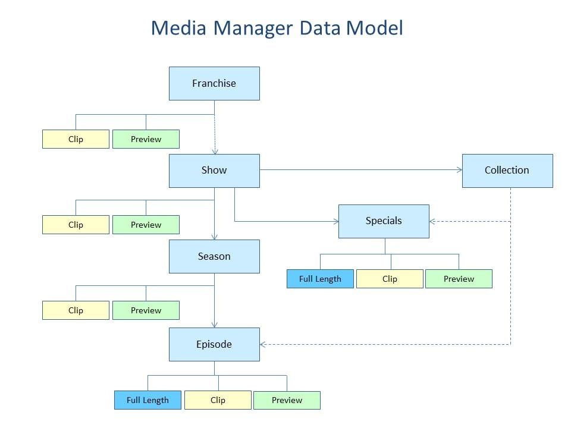

# PBS Media Manager PHP Library

This library abstracts interactions with the
[PBS Media Manager API](https://docs.pbs.org/display/MM/Media+Manager) based on
the Media Manager Core Data Model:





## Installation

Install via composer:

```bash
composer require openpublicmedia/pbs-media-manager-php
```

## Use

The primary class provided by this library is the
`OpenPublicMedia\PbsMediaManager\Client`. A `Client` instance can be used to
query the API in various ways based on the Core Data Model. The client requires
an API key and secret, provided by PBS.

### Response data structures

Responses from the `Client` class will return either a Generator in the case of
plural getters (e.g. `getFranchises`, `getShows`, `getSeasons`, etc.) or an
object for singular getters (e.g. `getEpisode`, `getCollection`, etc.). Search
methods (e.g. `searchShows`, `searchEpisodes`, etc.) also return Generators.

In all cases, objects representing API data follow a standard structure with the
following properties:

* `id`: guid for the object.
* `type`: string of the object type (e.g. "franchise", "show", "season", etc.).
* `links`: links to related API endpoints for the object.
* `attributes`: metadata about the object.

### Examples

#### Creating a client

```php
use OpenPublicMedia\PbsMediaManager\Client;

$api_key = 'xxxxxxxxxxxxxx';
$api_secret = 'xxxxxxxxxxx';

$client = new Client($api_key, $api_secret);
```

#### Getting all Franchises

```php
$franchises = $client->getFranchises();

foreach ($franchises as $franchise) {
    var_dump($franchise);
    class stdClass#45 (4) {
        public $links => class stdClass#40 (4) { ... }
        public $attributes => class stdClass#39 (18) { ... }
        public $type => string(9) "franchise"
        public $id => string(36) "e08bf78d-e6a3-44b9-b356-8753d01c7327"
      }
}
```

#### Getting a single Episode

```php
$episode = $client->getEpisode('08e7ee9c-800a-406f-86f0-bf0bb77fe42b');

var_dump($episode);
class stdClass#80 (3) {
    public $attributes => class stdClass#38 (20) { ... }
    public $id => string(36) "08e7ee9c-800a-406f-86f0-bf0bb77fe42b"
    public $type => string(7) "episode"
}
```

#### Searching (Franchises, Shows, Specials, and Episodes)

```php
$results = $client->searchEpisodes('Seattle');

foreach ($results as $result) {
    var_dump($result);
    class stdClass#45 (4) {
        public $links => class stdClass#40 (4) { ... }
        public $attributes => class stdClass#39 (18) { ... }
        public $type => string(9) "episode"
        public $id => string(36) "bb053151-7d3f-42bd-ac69-d0c19f040b27"
      }
}
```

#### Searching (Assets)

Assets have much more advanced search options that must be passed to the method
directly as query parameters. The example below searches for all Assets beloning
to a Show with "Mossback" in the *Show* title and both "Seattle" and "came" in
the *Episode" title.

See [Searching Assets](https://docs.pbs.org/display/CDA/Search+Assets) for
detailed documentation about available search filters.

```php
$results = $client->searchAssets([
    'show-title' => 'Mossback',
    'episode-title' => ['Seattle', 'came'],
]);

var_dump(count($results));
int(4)

foreach ($results as $r) {
    print "{$r->id}\t{$r->attributes->title}\r\n";
}

4eb40f99-cd4f-4582-9e8a-1ef0a99b8293    When Camelot Came to the Seattle World's Fair
e96d66c4-aa8e-4a83-a060-bd712178ff6b    The Music Festival That Came Before Woodstock
884e4401-de5e-4423-8cab-1c611dd6e624    When Mark Twain Came to Seattle
73d7b2fe-111b-4318-8721-e93937bf22ea    When the ‘American Hitler’ Came to Washington
```

#### Handling exceptions

Most plural `Client` getters (e.g. `Client::getShows`) can throw
`OpenPublicMedia\PbsMediaManager\Exception\BadRequestException`. This exception
will include a JSON encoded message that can be used to determine follow-up
actions. Singular getters (e.g. `Client::getShow`) will generally return `null`
for invalid IDs.

```php
try {
    $shows = $client->getShows(['page' => 100000]);
} catch (BadRequestException $e) {
    $message = json_decode($e->getMessage());
    var_dump($message);
    class stdClass#17 (1) {
      public $detail =>
      string(13) "Invalid page."
    }
}
```

## Development goals

See [CONTRIBUTING](CONTRIBUTING.md) for information about contributing to
this project.

### v1

- [x] API authentication (`OpenPublicMedia\PbsMediaManager\Client`)
- [x] API direct querying (`$client->request()`)
- [x] Result/error handling
- [x] GET wrappers for core data objects (`$client->getXXX()`)
- [x] Transparent paged response handling (`OpenPublicMedia\PbsMediaManager\Response\PagesResponse`)

### v1.x

- [ ] POST support (`OpenPublicMedia\PbsMediaManager\Client::post`)
    - [ ] Asset
    - [x] Episode (`OpenPublicMedia\PbsMediaManager\Client::addEpisode`)
    - [x] Special (`OpenPublicMedia\PbsMediaManager\Client::addSpecial`)
    - [x] Season (`OpenPublicMedia\PbsMediaManager\Client::addSeason`)
- [ ] PATCH support (`OpenPublicMedia\PbsMediaManager\Client::patch`)
    - [ ] Asset
    - [x] Episode (`OpenPublicMedia\PbsMediaManager\Client::updateEpisode`)
    - [x] Special (`OpenPublicMedia\PbsMediaManager\Client::updateSpecial`)
    - [ ] ~~Season~~ (unsupported by API)
    - [ ] Show
- [x] DELETE support (`OpenPublicMedia\PbsMediaManager\Client::delete`)
    - [x] Asset
    - [x] Episode (`OpenPublicMedia\PbsMediaManager\Client::deleteEpisode`)
    - [x] Special (`OpenPublicMedia\PbsMediaManager\Client::deleteSpecial`)
    - [ ] ~~Season~~ (unsupported by API)

### v2.x

- [ ] Entities for core data objects
- [ ] Advanced Asset availability handling
- [ ] Advanced Changelog endpoint operations
- [ ] Chainable query argument building (mostly for Asset search)
